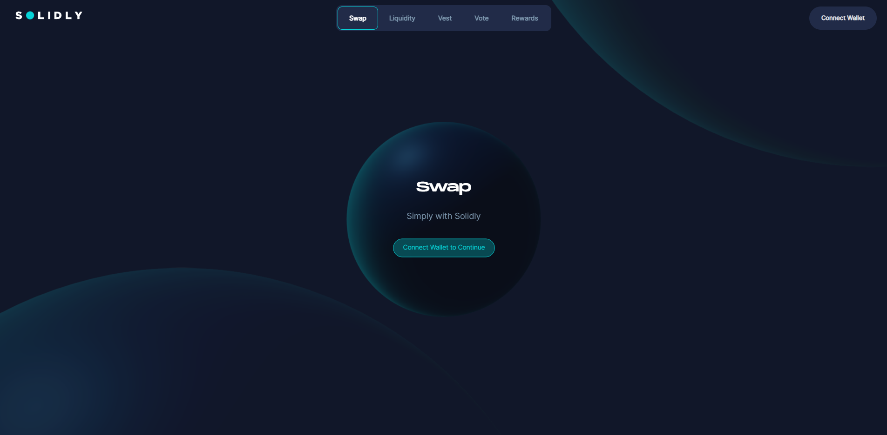

# Velodrome

## New Features

### Governance

Velodrome has minimal on-chain governance to ensure that emissions are effectively directed to incentivize the long-term growth of the Velodrome and broader Optimism ecosystems.

Governance has permission to do the following:

- Whitelist tokens for future gauge creation
- Create gauges for _any_ address, not just Velodrome trading pairs

Voting power in Velodrome Governance is calculated based on veVELO balance, and delegation automatically occurs when veVELO positions are modified.

Note that there's also an "Emergency Council" and a "Team" that are separate entities. The Emergency Council's sole purpose is to kill gauges (as to prevent "dummy pools" that we saw in Solidly). As such, it will be set to a multisig of key players in the Optimism ecosystem as to ensure credible neutrality.

### File remappings

- Interfaces moved to their own files in `contracts/interfaces/`
- Factories moved to their own files in `contracts/factories/`
- `BaseV1-token.sol` renamed to `Velo.sol`
- `BaseV1-core.sol` split into three files
  - `BaseV1Pair` renamed to `Pair` and moved to own file
  - `BaseV1Fees` renamed to `PairFees` and moved to own file
  - `BaseV1Factory` renamed to `PairFactory` and moved to own file
- `BaseV1-periphery.sol` renamed to `Router.sol`
- `ve.sol` renamed to `VotingEscrow.sol`
- `ve_dist.sol` renamed to `RewardsDistributor.sol`
- `BaseV1-gauges.sol` renamed to `Gauge.sol`
- `BaseV1-bribes.sol` renamed to `Bribe.sol`
- `BaseV1-voter.sol` renamed to `Voter.sol`
- `BaseV1-minter.sol` renamed to `Minter.sol`

### Setting up Tests for Velodrome

1. Get all submodules git pull --recurse-submodules

2. Forge Update to get all submodules like solmate `forge update`

3. Run tests : `forge test`

**Possible bugs and solution when setting up test:**

Bug: `Could not access submodule 'lib/ds-test’`

Solution : `git submodule update --init --recursive`

Below is from Solidly's `README.md`:

# Solidly README


[](https://codecov.io/gh/andrecronje/solidly)


Solidly allows low cost, near 0 slippage trades on uncorrelated or tightly correlated assets. The protocol incentivizes fees instead of liquidity. Liquidity providers (LPs) are given incentives in the form of `token`, the amount received is calculated as follows;

* 100% of weekly distribution weighted on votes from ve-token holders

The above is distributed to the `gauge` (see below), however LPs will earn between 40% and 100% based on their own ve-token balance.

LPs with 0 ve* balance, will earn a maximum of 40%.

## AMM

What differentiates Solidly's AMM;

Solidly AMMs are compatible with all the standard features as popularized by Uniswap V2, these include;

* Lazy LP management
* Fungible LP positions
* Chained swaps to route between pairs
* priceCumulativeLast that can be used as external TWAP
* Flashloan proof TWAP
* Direct LP rewards via `skim`
* xy>=k

Solidly adds on the following features;

* 0 upkeep 30 minute TWAPs. This means no additional upkeep is required, you can quote directly from the pair
* Fee split. Fees do not auto accrue, this allows external protocols to be able to profit from the fee claim
* New curve: x3y+y3x, which allows efficient stable swaps
* Curve quoting: `y = (sqrt((27 a^3 b x^2 + 27 a b^3 x^2)^2 + 108 x^12) + 27 a^3 b x^2 + 27 a b^3 x^2)^(1/3)/(3 2^(1/3) x) - (2^(1/3) x^3)/(sqrt((27 a^3 b x^2 + 27 a b^3 x^2)^2 + 108 x^12) + 27 a^3 b x^2 + 27 a b^3 x^2)^(1/3)`
* Routing through both stable and volatile pairs
* Flashloan proof reserve quoting

## token

**TBD**

## ve-token

Vested Escrow (ve), this is the core voting mechanism of the system, used by `BaseV1Factory` for gauge rewards and gauge voting.

This is based off of ve(3,3) as proposed [here](https://andrecronje.medium.com/ve-3-3-44466eaa088b)

* `deposit_for` deposits on behalf of
* `emit Transfer` to allow compatibility with third party explorers
* balance is moved to `tokenId` instead of `address`
* Locks are unique as NFTs, and not on a per `address` basis

```
function balanceOfNFT(uint) external returns (uint)
```

## BaseV1Pair

Base V1 pair is the base pair, referred to as a `pool`, it holds two (2) closely correlated assets (example MIM-UST) if a stable pool or two (2) uncorrelated assets (example FTM-SPELL) if not a stable pool, it uses the standard UniswapV2Pair interface for UI & analytics compatibility.

```
function mint(address to) external returns (uint liquidity)
function burn(address to) external returns (uint amount0, uint amount1)
function swap(uint amount0Out, uint amount1Out, address to, bytes calldata data) external
```

Functions should not be referenced directly, should be interacted with via the BaseV1Router

Fees are not accrued in the base pair themselves, but are transfered to `BaseV1Fees` which has a 1:1 relationship with `BaseV1Pair`

### BaseV1Factory

Base V1 factory allows for the creation of `pools` via ```function createPair(address tokenA, address tokenB, bool stable) external returns (address pair)```

Base V1 factory uses an immutable pattern to create pairs, further reducing the gas costs involved in swaps

Anyone can create a pool permissionlessly.

### BaseV1Router

Base V1 router is a wrapper contract and the default entry point into Stable V1 pools.

```

function addLiquidity(
    address tokenA,
    address tokenB,
    bool stable,
    uint amountADesired,
    uint amountBDesired,
    uint amountAMin,
    uint amountBMin,
    address to,
    uint deadline
) external ensure(deadline) returns (uint amountA, uint amountB, uint liquidity)

function removeLiquidity(
    address tokenA,
    address tokenB,
    bool stable,
    uint liquidity,
    uint amountAMin,
    uint amountBMin,
    address to,
    uint deadline
) public ensure(deadline) returns (uint amountA, uint amountB)

function swapExactTokensForTokens(
    uint amountIn,
    uint amountOutMin,
    route[] calldata routes,
    address to,
    uint deadline
) external ensure(deadline) returns (uint[] memory amounts)

```

## Gauge

Gauges distribute arbitrary `token(s)` rewards to BaseV1Pair LPs based on voting weights as defined by `ve` voters.

Arbitrary rewards can be added permissionlessly via ```function notifyRewardAmount(address token, uint amount) external```

Gauges are completely overhauled to separate reward calculations from deposit and withdraw. This further protect LP while allowing for infinite token calculations.

Previous iterations would track rewardPerToken as a shift everytime either totalSupply, rewardRate, or time changed. Instead we track each individually as a checkpoint and then iterate and calculation.

## Bribe

Gauge bribes are natively supported by the protocol, Bribes inherit from Gauges and are automatically adjusted on votes.

Users that voted can claim their bribes via calling ```function getReward(address token) public```

Fees accrued by `Gauges` are distributed to `Bribes`

### BaseV1Voter

Gauge factory permissionlessly creates gauges for `pools` created by `BaseV1Factory`. Further it handles voting for 100% of the incentives to `pools`.

```
function vote(address[] calldata _poolVote, uint[] calldata _weights) external
function distribute(address token) external
```

### veNFT distribution recipients

| Name | Address | Qty |
| :--- | :--- | :--- |
| Multichain | 0x5bDacBaE440A2F30af96147DE964CC97FE283305 | 800000 |
| 0xDAO | 0xa96D2F0978E317e7a97aDFf7b5A76F4600916021 | 2376588 |
| SpookySwap | 0x95478C4F7D22D1048F46100001c2C69D2BA57380 | 1331994 |
| Yearn Finance | 0xC0E2830724C946a6748dDFE09753613cd38f6767 | 1118072 |
| veDAO | 0x3293cB515Dbc8E0A8Ab83f1E5F5f3CC2F6bbc7ba | 1070472 |
| Curve | 0xffFfBBB50c131E664Ef375421094995C59808c97 | 1023840 |
| Tomb Finance | 0x02517411F32ac2481753aD3045cA19D58e448A01 | 864361 |
| Geist Finance | 0xf332789fae0d1d6f058bfb040b3c060d76d06574 | 812928 |
| Beefy Finance | 0xdFf234670038dEfB2115Cf103F86dA5fB7CfD2D2 | 795726 |
| RenVM | 0x0f2A144d711E7390d72BD474653170B201D504C8 | 763362 |
| Synapse | 0x224002428cF0BA45590e0022DF4b06653058F22F | 727329 |
| Radial | 0x26D70e4871EF565ef8C428e8782F1890B9255367 | 688233 |
| Iron Bank | 0xA5fC0BbfcD05827ed582869b7254b6f141BA84Eb | 681101 |
| SpiritSwap | 0x4D5362dd18Ea4Ba880c829B0152B7Ba371741E59 | 677507 |
| Scream | 0x1e26D95599797f1cD24577ea91D99a9c97cf9C09 | 676304 |
| Abracadabra | 0xb4ad8B57Bd6963912c80FCbb6Baea99988543c1c | 642992 |
| SushiSwap | 0xF9E7d4c6d36ca311566f46c81E572102A2DC9F52 | 609195 |
| Frax | 0xE838c61635dd1D41952c68E47159329443283d90 | 598412 |
| Reaper Farm | 0x111731A388743a75CF60CCA7b140C58e41D83635 | 591573 |
| Beethoven X | 0x0edfcc1b8d082cd46d13db694b849d7d8151c6d5 | 587431 |
| Hundred Finance | 0xD0Bb8e4E4Dd5FDCD5D54f78263F5Ec8f33da4C95 | 542785 |
| Morpheus Swap | 0x9685c79e7572faF11220d0F3a1C1ffF8B74fDc65 | 536754 |
| Saddle | 0xa70b1d5956DAb595E47a1Be7dE8FaA504851D3c5 | 518240 |
| Liquid Driver | 0x06917EFCE692CAD37A77a50B9BEEF6f4Cdd36422 | 511920 |
| Tarot | 0x5b0390bccCa1F040d8993eB6e4ce8DeD93721765 | 452870 |

### Testnet deployment

| Name | Address |
| :--- | :--- |
| wFTM| [0x27Ce41c3cb9AdB5Edb2d8bE253A1c6A64Db8c96d](https://testnet.ftmscan.com/address/0x27Ce41c3cb9AdB5Edb2d8bE253A1c6A64Db8c96d#code) |
| USDT| [0x8ad96050318043166114884b59E2fc82210273b3](https://testnet.ftmscan.com/address/0x8ad96050318043166114884b59E2fc82210273b3#code) |
| MIM | [0x976e33B07565b0c05B08b2e13AfFD3113e3D178d](https://testnet.ftmscan.com/address/0x976e33B07565b0c05B08b2e13AfFD3113e3D178d#code) |
| Solid | [0x0DB76C03fFF8F9f8d6600ca1f9aC004FDB73d442](https://testnet.ftmscan.com/address/0x0DB76C03fFF8F9f8d6600ca1f9aC004FDB73d442#code) |

| Name | Address |
| :--- | :--- |
| BaseV1Factory | [0x7dbA586e00D868EeFA13fC549B63D62b4a45a244](https://testnet.ftmscan.com/address/0x7dbA586e00D868EeFA13fC549B63D62b4a45a244#code) |
| BaseV1BribeFactory | [0xEc41c3165bc34eb5BDC66043FE3ac14617e4121c](https://testnet.ftmscan.com/address/0xEc41c3165bc34eb5BDC66043FE3ac14617e4121c#code) |
| BaseV1GaugesFactory | [0x3CE2B6952be35024411F6dE5A8626aA052E81C06](https://testnet.ftmscan.com/address/0x3CE2B6952be35024411F6dE5A8626aA052E81C06#code) |
| BaseV1Router01 | [0xD1D173c5d1de3175B32d3dDCB265BD00Ea9fEDf5](https://testnet.ftmscan.com/address/0xD1D173c5d1de3175B32d3dDCB265BD00Ea9fEDf5#code) |
| BaseV1Voter | [0xDA0eBF84F7A52A06EaeB0409F139D6442262F056](https://testnet.ftmscan.com/address/0xDA0eBF84F7A52A06EaeB0409F139D6442262F056#code) |
| veNFT | [0x74a91F1cEe46A20f5a15183aB54AEe89b015C21f](https://testnet.ftmscan.com/address/0x74a91F1cEe46A20f5a15183aB54AEe89b015C21f#code) |
| veNFT-dist | [0xACCF9d3b4084f85540D24e0aad0bE2c5F13BCDE2](https://testnet.ftmscan.com/address/0xACCF9d3b4084f85540D24e0aad0bE2c5F13BCDE2#code) |
| BaseV1Minter | [0x17C2074bb32d2B532ab479b6815ca1B50ff00024](https://testnet.ftmscan.com/address/0x17C2074bb32d2B532ab479b6815ca1B50ff00024#code) |

### Mainnet

| Name | Address |
| :--- | :--- |
| wFTM| [0x21be370d5312f44cb42ce377bc9b8a0cef1a4c83](https://ftmscan.com/address/0x21be370d5312f44cb42ce377bc9b8a0cef1a4c83#code) |
| Solid | [0x888EF71766ca594DED1F0FA3AE64eD2941740A20](https://ftmscan.com/address/0x888EF71766ca594DED1F0FA3AE64eD2941740A20#code) |
| BaseV1Factory | [0x3fAaB499b519fdC5819e3D7ed0C26111904cbc28](https://ftmscan.com/address/0x3fAaB499b519fdC5819e3D7ed0C26111904cbc28#code) |
| BaseV1BribeFactory | [0xD0333A1A1AbFD68B362c5aA71B95392745381379](https://ftmscan.com/address/0xD0333A1A1AbFD68B362c5aA71B95392745381379#code) |
| BaseV1GaugesFactory | [0x25d220723ED3D9C55fDb9CfDddF044b52639ccae](https://ftmscan.com/address/0x25d220723ED3D9C55fDb9CfDddF044b52639ccae#code) |
| BaseV1Router01 | [0xa38cd27185a464914D3046f0AB9d43356B34829D](https://ftmscan.com/address/0xa38cd27185a464914D3046f0AB9d43356B34829D#code) |
| BaseV1Voter | [0xdC819F5d05a6859D2faCbB4A44E5aB105762dbaE](https://ftmscan.com/address/0xdC819F5d05a6859D2faCbB4A44E5aB105762dbaE#code) |
| veNFT | [0xcBd8fEa77c2452255f59743f55A3Ea9d83b3c72b](https://ftmscan.com/address/0xcBd8fEa77c2452255f59743f55A3Ea9d83b3c72b#code) |
| veNFT-dist | [0xA5CEfAC8966452a78d6692837b2ba83d19b57d07](https://ftmscan.com/address/0xA5CEfAC8966452a78d6692837b2ba83d19b57d07#code) |
| BaseV1Minter | [0xC4209c19b183e72A037b2D1Fb11fbe522054A90D](https://ftmscan.com/address/0xC4209c19b183e72A037b2D1Fb11fbe522054A90D#code) |

## Security

- [Immunefi Bug Bounty Program](https://immunefi.com/bounty/solidly/)  
- [Bug Bounty Program](https://github.com/andrecronje/solidly/blob/master/SECURITY.md)  

* [MythX: voter.sol](https://github.com/andrecronje/solidly/blob/master/audits/17faf962f99a7e7e3f26f8bc.pdf)
* [MythX: ve.sol](https://github.com/andrecronje/solidly/blob/master/audits/4094394a6bc512d57672533c.pdf)
* [MythX: gauges.sol](https://github.com/andrecronje/solidly/blob/master/audits/4212b799deea3d9dd8f8620e.pdf)
* [MythX: core.sol](https://github.com/andrecronje/solidly/blob/master/audits/79effbd69276f2d16698b72d.pdf)
* [MythX: minter.sol](https://github.com/andrecronje/solidly/blob/master/audits/dea98051d23c85bcaa80dc5a.pdf)
* [PeckShield](https://github.com/andrecronje/solidly/blob/master/audits/e456a816-3802-4384-894c-825a4177245a.pdf)
